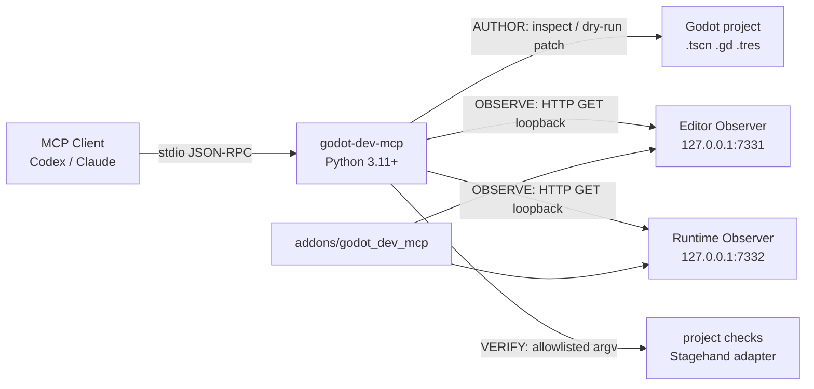

# godot-dev-mcp

[](https://github.com/DLeungDL/godot-dev-mcp/actions/workflows/ci.yml)
[](https://github.com/DLeungDL/godot-dev-mcp)
[](https://www.python.org/downloads/)
[](https://godotengine.org/)
[](https://modelcontextprotocol.io/)
[](LICENSE)

[中文](README.md) · [English](README.en.md)

Safe, composable **MCP** (Model Context Protocol) gateway for **Godot**: scene authoring, read-only runtime diagnostics, and allowlisted verification.

Current version is `0.2.0`. Python 3.11+ is required.

## Contents

- [What it is](#what-it-is)
- [Architecture](#architecture)
- [Capability boundaries](#capability-boundaries)
- [Quick start](#quick-start)
- [Observer connections](#observer-connections)
- [Tools](#tools)
- [Project config and VERIFY](#project-config-and-verify)
- [Verification status](#verification-status)
- [Safety boundaries](#safety-boundaries)
- [License and sources](#license-and-sources)

## What it is

`godot-dev-mcp` lets MCP clients such as Codex inspect and change Godot projects with structured tools, instead of guessing `.tscn` formats or running arbitrary commands.

| You can | It will not |
|---|---|
| Inspect scenes, nodes, resources, signals, and scripts | Run arbitrary shell commands |
| Preview a single scene-property change with dry-run | Read arbitrary files or write at runtime |
| Read the Editor or game scene tree, logs, screenshots, and performance | Expose the observation bridge off loopback |
| Run allowlisted tests and Stagehand scenarios | Bind a specific game project into the generic core |

The MCP server uses standard **stdio transport**: one UTF-8 JSON-RPC message per line. It supports requests, notifications, and batches, and never writes non-protocol content to stdout.

## Architecture



## Capability boundaries

| Layer | Purpose | Write behavior |
|---|---|---|
| **AUTHOR** | Inspect scenes, nodes, resources, signals, and scripts, and patch a single scene property | Mutations default to dry-run; writes only when dry-run is explicitly disabled |
| **OBSERVE** | Read the Editor or game scene tree, node properties, performance, logs, and screenshots | Read-only; loopback HTTP GET only |
| **VERIFY** | Run allowlisted test commands and parse Stagehand, JUnit, and visual-diff output | Runs explicit argument arrays only; never through a shell |

## Quick start

### 1. Install the Python package

```powershell
git clone https://github.com/DLeungDL/godot-dev-mcp.git
Set-Location godot-dev-mcp
python -m pip install -e .
python -m unittest discover -s tests -v
```

### 2. Enable the Godot addon

Copy [`addons/godot_dev_mcp`](addons/godot_dev_mcp) from this repository into the target Godot project's `addons/` folder. In Godot, open **Project Settings → Plugins** and enable **godot-dev-mcp Observer**.

Enabling the addon also registers the `GodotDevMCPRuntimeObserver` autoload. Restart the Godot Editor after the first install or an addon update so Observer loads in normal editor sessions.

### 3. Start the MCP server

To inspect the scene tree in the Godot Editor, use the default Editor Observer:

```powershell
python -m godot_dev_mcp.server --project "C:\path\to\godot-project"
```

To inspect a running game, start the game from Godot first, then connect Runtime Observer:

```powershell
python -m godot_dev_mcp.server `
  --project "C:\path\to\godot-project" `
  --bridge-url "http://127.0.0.1:7332"
```

### 4. Connect Codex

```toml
[mcp_servers.godot_dev]
command = "python"
args = ["-m", "godot_dev_mcp.server", "--project", "C:\\path\\to\\godot-project"]
cwd = "C:\\path\\to\\godot-dev-mcp"
```

To connect a running game, change `args` to:

```toml
args = [
  "-m", "godot_dev_mcp.server",
  "--project", "C:\\path\\to\\godot-project",
  "--bridge-url", "http://127.0.0.1:7332"
]
```

## Observer connections

| Observer | Default URL | Scope |
|---|---|---|
| Editor Observer | `http://127.0.0.1:7331` | Godot Editor scene tree |
| Runtime Observer | `http://127.0.0.1:7332` | Running game scene tree |

Quick health checks:

```powershell
Invoke-RestMethod http://127.0.0.1:7331/health
Invoke-RestMethod http://127.0.0.1:7332/health
```

Runtime Observer starts in debug builds only. To enable it in a release build, set:

```text
godot_dev_mcp/allow_release_observer=true
```

Change the runtime port with `godot_dev_mcp/runtime_port`. If you change the port, the MCP server `--bridge-url` must match.

Runtime Observer uses a custom Godot `Logger` to capture engine messages, `push_warning()`, `push_error()`, script errors, and shader errors. Logger callbacks enqueue work under a `Mutex`; the main thread then writes a ring buffer of at most 500 entries. Screenshots need a display server; headless mode returns `503 Service Unavailable`.

## Tools

| Layer | Tools |
|---|---|
| AUTHOR | `godot_project_info`, `godot_scene_inspect`, `godot_scene_patch`, `godot_resource_inspect`, `godot_script_diagnostics` |
| OBSERVE | `godot_runtime_snapshot`, `godot_runtime_property`, `godot_runtime_logs`, `godot_runtime_screenshot`, `godot_runtime_errors`, `godot_resource_leaks` |
| VERIFY | `godot_run_check`, `godot_stagehand_scenario`, `godot_validate_scene`, `godot_validate_autoload` |

`godot_scene_patch` defaults `dry_run` to `true`. A write happens only when you pass `false`, and only for a single `.tscn` property. Node selectors accept a name, relative path, or full scene path; ambiguous names are rejected. Replacing an existing multiline property removes the full old value. The result includes the resolved `scene_path` plus a before/after change summary.

`godot_scene_inspect` returns bounded `structured_nodes` with node name, type, parent, scene path, and up to 100 properties. Multiline properties keep their full serialized form. Each value is capped at 4,096 characters, each node at 32,768 characters, and the whole scene at 131,072 characters. Truncated items are listed in `truncated_properties`. Pass an optional `node` selector to get an exact `selected_node` by name or scene path; use the full path when the name is not unique.

`godot_runtime_snapshot` returns a depth-first flat `nodes` page with `pagination`:

- Default `limit=100`, maximum `500`
- Use `next_offset` for the next page
- `max_depth` maximum is `16`
- `offset` maximum is `100000`

## Project config and VERIFY

Copy [`examples/godot-dev-mcp.example.json`](examples/godot-dev-mcp.example.json) to `godot-dev-mcp.json` at the target project root, then edit it for that project.

```json
{
  "checks": {
    "smoke": ["godot", "--headless", "--path", ".", "--quit-after", "60"]
  },
  "stagehand": {
    "command": ["godot-stagehand", "run", "--out-dir", "stagehand-artifacts"],
    "junit": "stagehand-artifacts/junit.xml",
    "report": "stagehand-artifacts/report.json",
    "visual_diff": "stagehand-artifacts/visual-diff.json"
  }
}
```

- Check names are the allowlist accepted by `godot_run_check`.
- Commands must be non-empty string arrays and start with `shell=false`.
- Timeouts are 1–900 seconds.
- Stagehand stays a separate adapter; this project only passes a scenario and parses structured artifacts.
- A Stagehand scenario example is in [`examples/auction-ui.stagehand.json`](examples/auction-ui.stagehand.json).

## Verification status

CI in this repository runs:

- Python unit tests and MCP stdio subprocess integration tests
- Python `compileall` plus wheel/sdist packaging
- Godot 4.7.1 Mono headless Editor addon load

Runtime Observer has also been checked against the official [`2d/dodge_the_creeps`](https://github.com/godotengine/godot-demo-projects/tree/master/2d/dodge_the_creeps) demo: it can read a real game scene tree, performance monitors, and structured runtime errors.

The version 2 integration roadmap is in [Issue #1](https://github.com/DLeungDL/godot-dev-mcp/issues/1).

## Safety boundaries

- Project paths are resolved and path traversal is rejected.
- The observation bridge must use HTTP loopback.
- Runtime properties are limited to engine properties; script-defined properties are not exposed.
- Lists, process output, tree depth, snapshot pages, and log buffers are all bounded.
- There is no arbitrary shell command, arbitrary file-read, or runtime write interface.
- Project-specific extensions are off by default; the generic core does not depend on game-specific code.

## License and sources

This project is MIT licensed and is a clean-room implementation. Interface review and attribution for external projects are in [`THIRD_PARTY_NOTICES.md`](THIRD_PARTY_NOTICES.md).

