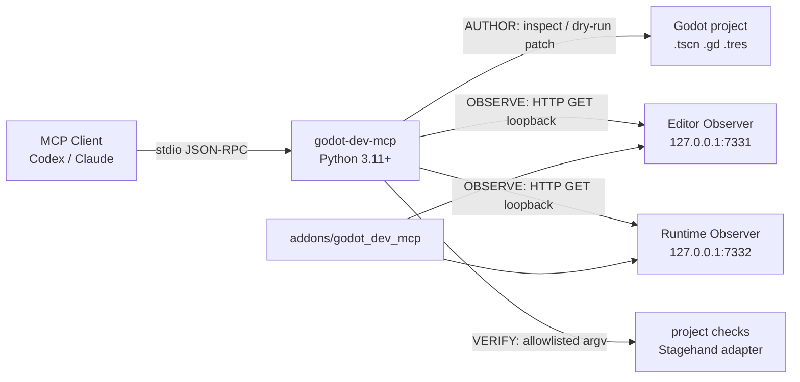

# godot-dev-mcp

[](https://github.com/DLeungDL/godot-dev-mcp/actions/workflows/ci.yml)
[](https://github.com/DLeungDL/godot-dev-mcp)
[](https://www.python.org/downloads/)
[](https://godotengine.org/)
[](https://modelcontextprotocol.io/)
[](LICENSE)

Safe, composable **MCP** (Model Context Protocol) gateway for **Godot**: scene authoring, read-only runtime diagnostics, and allowlisted verification.

`godot-dev-mcp` 是一個安全、可組合的 Godot MCP 開發閘道（gateway），提供場景建構、唯讀執行期診斷與外部驗證整合。核心套件適用於一般 Godot 專案，不綁定特定遊戲。

目前版本為 `0.2.0`。Python 需求為 3.11 以上；GDScript 外掛已使用 Godot 4.7.1 Mono 驗證。

## 目錄

- [這是什麼](#這是什麼)
- [架構](#架構)
- [能力邊界](#能力邊界)
- [快速開始](#快速開始)
- [Observer 連線](#observer-連線)
- [工具](#工具)
- [專案設定與 VERIFY](#專案設定與-verify)
- [驗證狀態](#驗證狀態)
- [安全邊界](#安全邊界)
- [授權與來源](#授權與來源)

## 這是什麼

`godot-dev-mcp` 讓 MCP 用戶端（例如 Codex）用結構化工具檢查與修改 Godot 專案，而不是猜測 `.tscn` 格式或執行任意指令。

| 你可以用它做 | 它故意不做 |
|---|---|
| 檢查 scene、node、resource、signal、script | 任意 shell command |
| 以 dry-run 預覽單一場景屬性修改 | 任意檔案讀取或 runtime 寫入 |
| 讀取 Editor／遊戲 scene tree、日誌、截圖與效能 | 對非 loopback 位址開放觀察通道 |
| 執行設定檔允許的測試與 Stagehand scenario | 把特定遊戲專案綁進通用核心 |

MCP Server 使用標準 **stdio transport**：每行一個 UTF-8 JSON-RPC 訊息，支援 request、notification 與 batch，且不會在 stdout 寫入非協定內容。

## 架構



## 能力邊界

| 分層 | 用途 | 寫入行為 |
|---|---|---|
| **AUTHOR** | 檢查 scene、node、resource、signal、script，並修改單一場景屬性 | 修改預設為 dry-run，必須明確停用 dry-run 才會寫入 |
| **OBSERVE** | 讀取 Editor／遊戲 scene tree、Node property、效能、日誌與截圖 | 唯讀，只接受 loopback HTTP GET |
| **VERIFY** | 執行設定檔允許的測試命令，整合 Stagehand、JUnit 與 visual diff | 只執行明確允許的 argument array，不經 shell |

## 快速開始

### 1. 安裝 Python 套件

```powershell
git clone https://github.com/DLeungDL/godot-dev-mcp.git
Set-Location godot-dev-mcp
python -m pip install -e .
python -m unittest discover -s tests -v
```

### 2. 啟用 Godot 外掛

將本儲存庫的 [`addons/godot_dev_mcp`](addons/godot_dev_mcp) 複製到目標 Godot 專案的 `addons/`，然後在 Godot 中開啟 **Project Settings → Plugins**，啟用 **godot-dev-mcp Observer**。

外掛啟用後會自動加入 `GodotDevMCPRuntimeObserver` autoload。第一次安裝或更新外掛後，請重新啟動 Godot Editor，確保 Observer 在日常工作階段載入。

### 3. 啟動 MCP Server

檢查 Godot Editor 中的場景樹時，使用預設 Editor Observer：

```powershell
python -m godot_dev_mcp.server --project "C:\path\to\godot-project"
```

檢查正在執行的遊戲場景樹時，先從 Godot 啟動遊戲，再連接 Runtime Observer：

```powershell
python -m godot_dev_mcp.server `
  --project "C:\path\to\godot-project" `
  --bridge-url "http://127.0.0.1:7332"
```

### 4. 接到 Codex

```toml
[mcp_servers.godot_dev]
command = "python"
args = ["-m", "godot_dev_mcp.server", "--project", "C:\\path\\to\\godot-project"]
cwd = "C:\\path\\to\\godot-dev-mcp"
```

若要連接正在執行的遊戲，將 `args` 改為：

```toml
args = [
  "-m", "godot_dev_mcp.server",
  "--project", "C:\\path\\to\\godot-project",
  "--bridge-url", "http://127.0.0.1:7332"
]
```

## Observer 連線

| Observer | 預設位址 | 範圍 |
|---|---|---|
| Editor Observer | `http://127.0.0.1:7331` | Godot Editor scene tree |
| Runtime Observer | `http://127.0.0.1:7332` | 正在執行的遊戲 scene tree |

快速健康檢查：

```powershell
Invoke-RestMethod http://127.0.0.1:7331/health
Invoke-RestMethod http://127.0.0.1:7332/health
```

Runtime Observer 預設只在 debug build 啟動。若確實需要在 release build 啟用，必須明確設定：

```text
godot_dev_mcp/allow_release_observer=true
```

可透過 `godot_dev_mcp/runtime_port` 修改執行期連接埠。若修改連接埠，MCP Server 的 `--bridge-url` 必須同步調整。

Runtime Observer 使用 Godot 自訂 `Logger` 擷取引擎訊息、`push_warning()`、`push_error()`、script error 與 shader error。Logger 回呼以 `Mutex` 保護待處理佇列，再由主執行緒寫入最多 500 筆的 ring buffer。截圖需要可用的顯示伺服器；headless 模式會回傳 `503 Service Unavailable`。

## 工具

| 分層 | 工具 |
|---|---|
| AUTHOR | `godot_project_info`, `godot_scene_inspect`, `godot_scene_patch`, `godot_resource_inspect`, `godot_script_diagnostics` |
| OBSERVE | `godot_runtime_snapshot`, `godot_runtime_property`, `godot_runtime_logs`, `godot_runtime_screenshot`, `godot_runtime_errors`, `godot_resource_leaks` |
| VERIFY | `godot_run_check`, `godot_stagehand_scenario`, `godot_validate_scene`, `godot_validate_autoload` |

`godot_scene_patch` 的 `dry_run` 預設為 `true`。只有明確傳入 `false` 才會寫入單一 `.tscn` property；節點 selector 可使用名稱、相對路徑或完整 scene path，名稱不唯一時會拒絕修改。替換既有多行 property 時會移除完整舊值，回傳結果包含解析後的 `scene_path` 與 before／after 變更摘要。

`godot_scene_inspect` 會回傳有界限的 `structured_nodes`，包含節點名稱、型別、parent、scene path 與最多 100 個 property。多行 property 會保留完整序列化格式；每個值最多 4,096 字元、每個節點最多 32,768 字元、整個場景最多 131,072 字元，截斷項目會列在 `truncated_properties`。傳入選用的 `node` selector，可依名稱或 scene path 精確取得 `selected_node`；名稱不唯一時必須改用完整路徑。

`godot_runtime_snapshot` 回傳深度優先的平面 `nodes` 頁面與 `pagination`：

- 預設 `limit=100`，最大 `500`
- 使用 `next_offset` 取得下一頁
- `max_depth` 最大為 `16`
- `offset` 最大為 `100000`

## 專案設定與 VERIFY

將 [`examples/godot-dev-mcp.example.json`](examples/godot-dev-mcp.example.json) 複製為目標專案根目錄的 `godot-dev-mcp.json`，再按專案需要修改。

```json
{
  "checks": {
    "smoke": ["godot", "--headless", "--path", ".", "--quit-after", "60"]
  },
  "stagehand": {
    "command": ["godot-stagehand", "run", "--out-dir", "stagehand-artifacts"],
    "junit": "stagehand-artifacts/junit.xml",
    "report": "stagehand-artifacts/report.json",
    "visual_diff": "stagehand-artifacts/visual-diff.json"
  }
}
```

- `checks` 的名稱就是 `godot_run_check` 可接受的 allowlist。
- 命令必須是非空字串陣列，以 `shell=false` 啟動。
- timeout 範圍為 1–900 秒。
- Stagehand 維持獨立 adapter；本專案只傳入 scenario 並解析結構化產物。
- Stagehand 情境範例位於 [`examples/auction-ui.stagehand.json`](examples/auction-ui.stagehand.json)。

## 驗證狀態

本儲存庫的 CI 會執行：

- Python 單元與 MCP stdio 子程序整合測試
- Python `compileall` 與 wheel／sdist packaging
- Godot 4.7.1 Mono headless Editor 外掛載入測試

Runtime Observer 亦已使用 Godot 官方 [`2d/dodge_the_creeps`](https://github.com/godotengine/godot-demo-projects/tree/master/2d/dodge_the_creeps) demo 驗證，可讀取真實遊戲 scene tree、效能 monitor 與結構化 runtime errors。

第 2 版整合路線圖見 [Issue #1](https://github.com/DLeungDL/godot-dev-mcp/issues/1)。

## 安全邊界

- 專案路徑會以 resolved path 驗證並拒絕 path traversal。
- Observation bridge 必須使用 HTTP loopback。
- Runtime property 只允許引擎 property，不暴露 script-defined property。
- 所有列表、程序輸出、tree depth、snapshot page 與 log buffer 均有界限。
- 不提供任意 shell command、任意檔案讀取或 runtime 寫入介面。
- 專案專用擴充預設關閉，通用核心不依賴特定遊戲程式碼。

## 授權與來源

本專案使用 MIT License，並維持 clean-room 實作。外部專案的介面評估與授權說明見 [`THIRD_PARTY_NOTICES.md`](THIRD_PARTY_NOTICES.md)。

